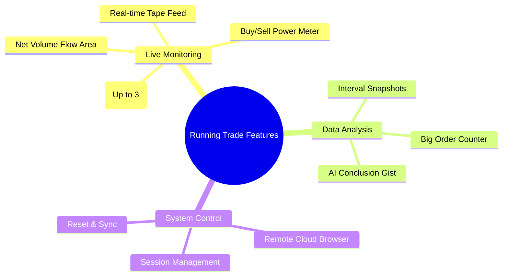
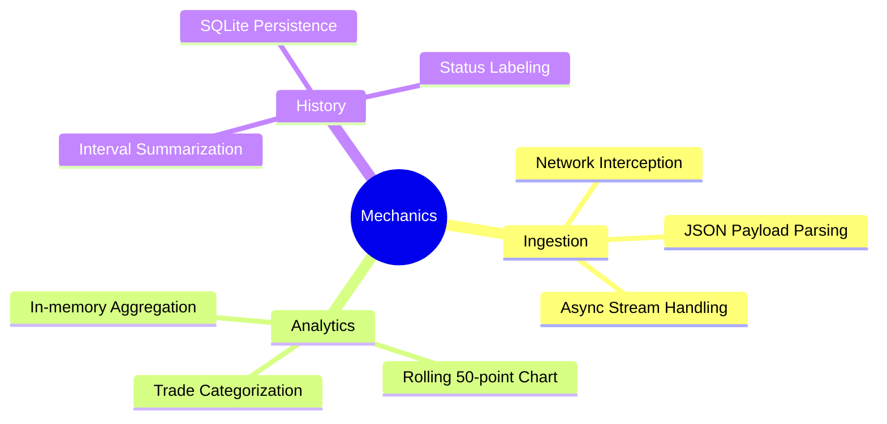
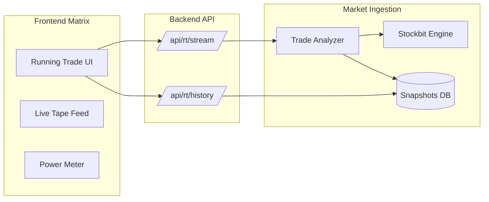
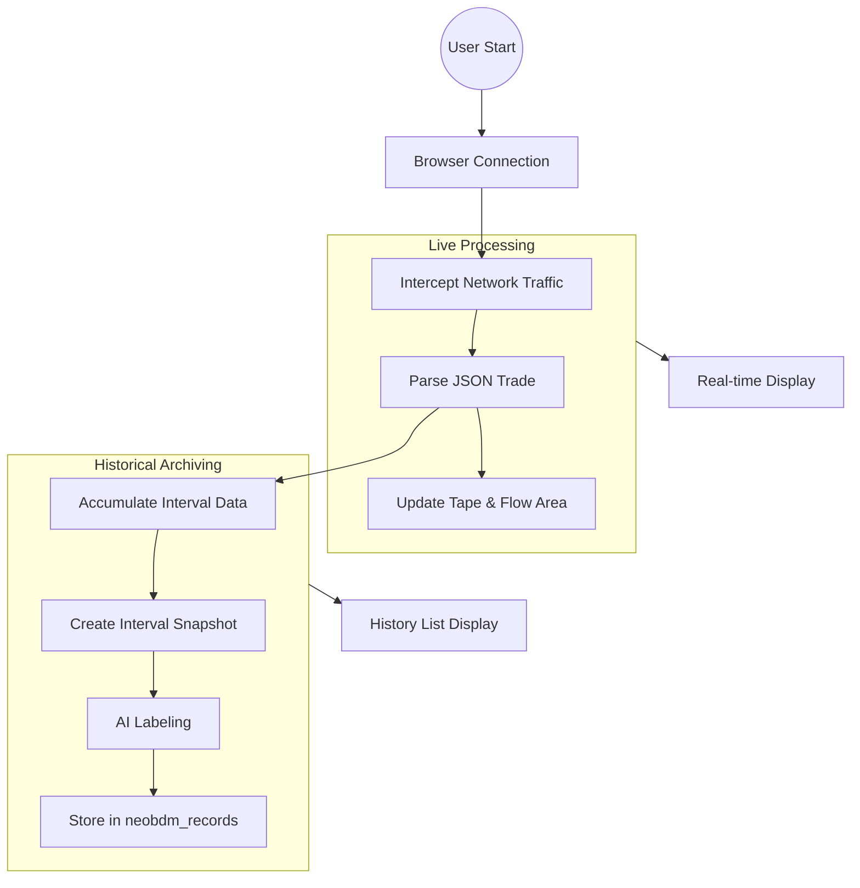

# Running Trade - Live Tape & RT History Documentation

Dokumentasi ini menjelaskan fitur, alur kerja, cara kerja, dan arsitektur dari modul **Running Trade Monitoring System**.

---

## 1. Fitur Utama

### A. Live Tape
- **Streaming Trade Feed**: Menampilkan setiap transaksi yang terjadi di bursa secara real-time.
- **Power Meter**: Visualisasi kekuatan beli (Buy Power) vs kekuatan jual (Sell Power) dalam format *gauge*.
- **Net Volume Chart**: Grafik area real-time yang menunjukkan akumulasi volume (Net Lots) detik demi detik.
- **Multi-Ticker Matrix**: Mendukung pemantauan hingga 3 emiten sekaligus dalam satu layar.

### B. RT History (Interval Snapshots)
- **Snapshot Generation**: Penyimpanan otomatis rangkuman aktivitas perdagangan setiap interval waktu tertentu (misal: per 1-5 menit).
- **Big Order Detection**: Menghitung jumlah pesanan berkapasitas besar yang masuk dalam satu snapshot.
- **AI-Driven Conclusion**: Memberikan kesimpulan otomatis (Bullish/Bearish/Netral) berdasarkan dinamika bid-ask dan volume di setiap interval.



---

## 2. Alur Kerja (Flow)

Alur kerja Running Trade melibatkan intersepsi data trafik secara langsung.

1.  **System Start**: User menekan "Start Live", backend meluncurkan *cloud browser* dengan Playwright.
2.  **Traffic Interception**: Backend mencegat websocket/API data dari Stockbit/Ajaib tanpa menggunakan OCR.
3.  **Real-time Stream**: Data yang dicegat dikirim ke frontend via endpoint `/api/rt/stream` setiap detik.
4.  **Aggregation**: Backend (`accum_dist.py`) menghitung agregat volume dan harga secara terus menerus di memori.
5.  **Snapshotting**: Setiap interval berakhir, backend menyimpan kondisi terakhir ke database sebagai "History Snapshot".

```mermaid
graph TD
    A[Frontend: Start Stream] --> B[Backend: Launch Headless Browser]
    B --> C[Traffic Interceptor: Capture Payload]
    C --> D[Trade Analyzer: Calculate Buy/Sell Power]
    D --> E[/api/rt/stream: Push Data to UI]
    D --> F{Interval Ended?}
    F -- Yes --> G[Save Snapshot to DB]
    G --> H[Update RT History Section]
    E --> I[Render Live Tape & Gauge]
```

---

## 3. Cara Kerja (Mechanics)

### Traffic Ingestion
Tidak menggunakan Computer Vision. Backend mengintersepsi request jaringan dan memproses payload JSON/Protobuf asli untuk mendapatkan akurasi 100% dan latensi minimum.

### Power Meter Calculation
`Buy Power % = (Buy Volume / Total Volume) * 100`
Memberikan indikasi psikologi pasar: apakah pembeli lebih agresif (*Hajar Kanan*) atau penjual lebih dominan (*Hajar Kiri*).

### History Snapshots
Menyimpan metrik kunci pada titik waktu tertentu:
- `Interval Start/End`
- `Net Volume`
- `Avg Price`
- `Big Order Count`
- `Automated Conclusion`



---

## 4. Arsitektur

Modul ini adalah yang paling kompleks karena melibatkan pemrosesan data bursa secara langsung.

- **Component**: `RunningTradePage`, `LiveTape`, `PowerMeter`.
- **Backend Core**: 
    - `stockbit_client.py`: Menangani browser dan traffic capture.
    - `accum_dist.py`: Logika perhitungan akumulasi-distribusi.
- **Data Flow**: Frontend (Polling 1s) <-> FastAPI <-> Stockbit Engine (Headless).



---

## 5. Keseluruhan Alur (End-to-End Flow)


